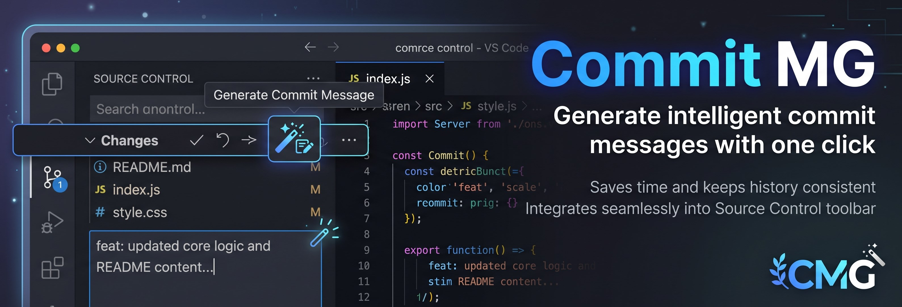

# Commit MG

A tiny VS Code extension that adds a single button to the Source Control **Changes** toolbar to generate commit message.



## Development

```bash
npm install
npm run compile   # or: npm run watch
```

Press `F5` to launch the Extension Development Host and try the extension.
